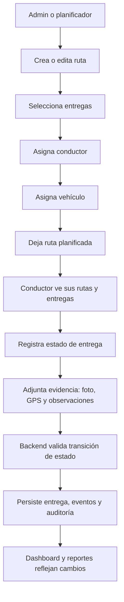
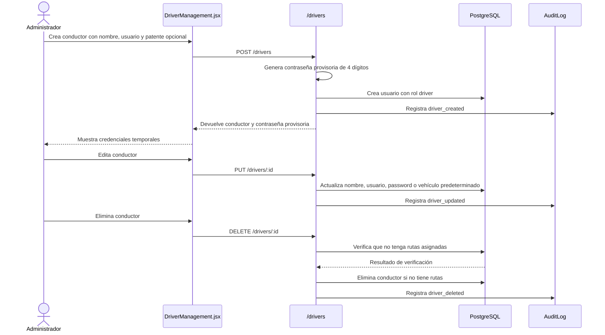
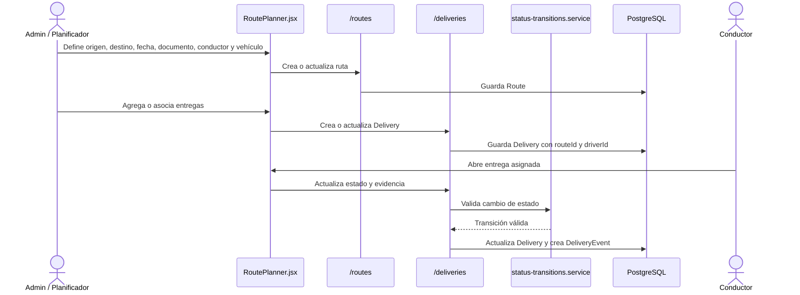
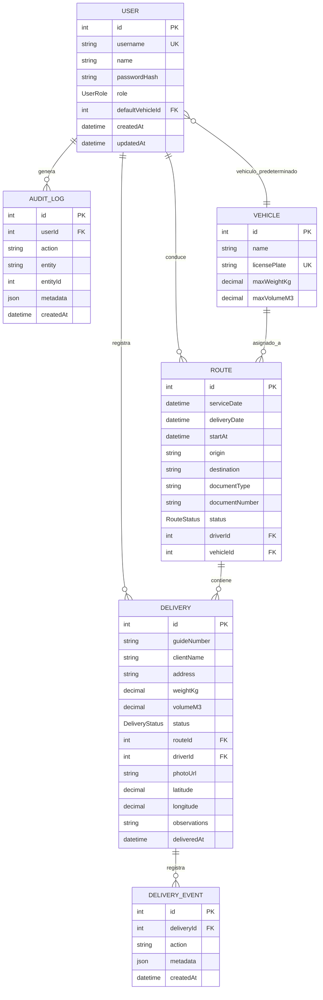
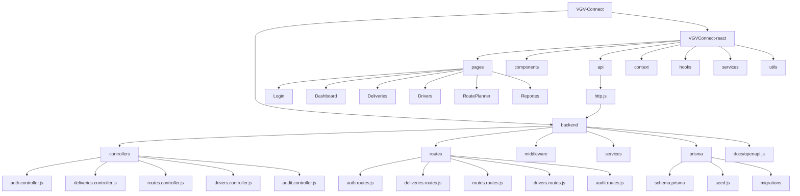

# Diagramas de flujos de trabajo y módulos

Este documento resume los flujos principales de VGV Connect y la relación entre módulos de frontend, backend y base de datos.

## Vista general de módulos

```mermaid
flowchart LR
  Usuario[Usuarios del sistema] --> Frontend[Frontend React + Vite]

  subgraph FrontendModules[Frontend]
    Login[Login]
    Layout[Layout, Navbar y Sidebar]
    Home[Home]
    Dashboard[Dashboard operativo]
    Entregas[Administración de entregas]
    Rutas[Planificador de rutas]
    Conductores[Conductores]
    Reportes[Reportes]
    Chofer[Panel de conductor]
  end

  Frontend --> FrontendModules
  FrontendModules --> ApiClient[API clients Axios]

  ApiClient --> Backend[Backend Express]

  subgraph BackendModules[Backend]
    AuthAPI[/auth]
    DeliveriesAPI[/deliveries]
    RoutesAPI[/routes]
    DriversAPI[/drivers]
    AuditAPI[/audit]
    DocsAPI[/api-docs y /openapi.json]
    Middleware[Auth middleware y roles]
    Services[Servicios: auditoría, estados, geocoding, Google Drive]
  end

  Backend --> Middleware
  Middleware --> BackendModules
  BackendModules --> Prisma[Prisma Client]
  Prisma --> Postgres[(PostgreSQL)]
```

## Acceso por rol

```mermaid
flowchart TD
  Login[Inicio de sesión] --> Token[JWT + usuario autenticado]
  Token --> RoleHome{Rol}

  RoleHome -->|admin| AdminHome[/dashboard]
  RoleHome -->|route_planner| PlannerHome[/rutas]
  RoleHome -->|billing| BillingHome[/reportes]
  RoleHome -->|driver| DriverHome[/chofer]

  AdminHome --> AdminModules[Dashboard, entregas, rutas, conductores y reportes]
  PlannerHome --> PlannerModules[Dashboard, rutas, conductores y entregas]
  BillingHome --> BillingModules[Dashboard, reportes y entregas]
  DriverHome --> DriverModules[Mis entregas y registro de entrega]
```

## Flujo operativo principal



## Flujo de administración de conductores



## Flujo de ruta y entregas



## Modelo de datos principal



## Mapa de módulos por carpeta



## Responsabilidades por módulo

| Módulo | Responsabilidad principal |
| --- | --- |
| Login/Auth | Autenticación, persistencia del token y redirección por rol. |
| Dashboard | Lectura de KPIs, tabla, filtros, gráficos y mapa operativo. |
| Entregas | Gestión y seguimiento de entregas, estados y evidencia. |
| Rutas | Creación, planificación y asignación de rutas a conductor/vehículo. |
| Conductores | Resumen operativo y mantención de conductores. |
| Reportes | Métricas históricas y rendimiento por período/conductor. |
| API Express | Expone endpoints, aplica CORS, auth y reglas de negocio. |
| Prisma/PostgreSQL | Persistencia de usuarios, vehículos, rutas, entregas, eventos y auditoría. |
| Servicios backend | Auditoría, transiciones de estado, geocoding y almacenamiento de evidencias. |
